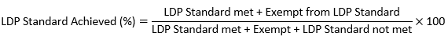

```{r load-setup, include=FALSE}
source(here::here("code", "00_setup-environment.R"))
library(crosstalk) # for drop down menus
library(htmltools)

# Write numbers with thousands separator
knit_hooks$set(inline = function(x){
  if(!is.character(x)){prettyNum(x, big.mark=",")}else{x}
})
```

---
date: "`r paste('Data as at', format(end_date, '%d %B %Y'))`"
---

```{r setup, include=FALSE}

# Remove tidylog
detach("package:tidylog", unload = TRUE)

# Load functions
walk(dir(here::here("functions"), full.names = TRUE), source)


# Load PDS monthly data
pds <- read_rds(get_mi_data_path("final_data", ext = "rds", test_output = test_output)) %>% 
  
  # Remove codes from board and IJB
  mutate(health_board = str_sub(health_board, 3, -1),
         ijb          = if_else(is.na(ijb),
                                "Unknown",
                                str_sub(ijb, 11, -1)))

# Load expected diagnoses reference file
exp <- read_csv(get_exp_diagnoses_path())


# Load error and queries summaries
q_err <- read_rds(get_mi_data_path("q_error_data", ext = "rds", test_output = test_output)) %>% 

  mutate(ijb = if_else(is.na(ijb),
                                "Unknown",
                                str_sub(ijb, 11, -1)))

query <- read_rds(get_mi_data_path("query_data", ext = "rds", test_output = test_output)) %>% 

  mutate(ijb = if_else(is.na(ijb),
                                "Unknown",
                                str_sub(ijb, 11, -1)))

err <- read_rds(get_mi_data_path("error_data", ext = "rds", test_output = test_output)) %>% 

  mutate(ijb = if_else(is.na(ijb),
                                "Unknown",
                                str_sub(ijb, 11, -1)))

# calculate monthly referrals for Scotland and health boards
pds_ijb <- pds %>% arrange(ijb)

pds_ijb %<>% rename(geog = ijb) 

pds_ijb$geog<- factor(pds_ijb$geog, levels = unique(pds_ijb$geog))

pds_scot <- pds %>% group_by(health_board = "Scotland", ijb = "Scotland", fy, month, ldp_full, ldp, age_grp_2, age_grp, simd, sex) %>%  summarise(referrals = sum(referrals), .groups = "drop")

pds_scot %<>% rename(geog = ijb) 

pds_scot$geog<- factor(pds_scot$geog, levels = unique(pds_scot$geog))

pds_hb <- pds %>% group_by(health_board, fy, month, ldp_full, ldp, age_grp_2, age_grp, simd, sex) %>% 
  summarise(referrals = sum(referrals), .groups = "drop") %>% mutate(ijb = health_board, .before = fy)

pds_hb %<>% rename(geog = ijb) 

pds_hb$geog<- factor(pds_hb$geog, levels = unique(pds_hb$geog))

# combine monthly data for ijb, hb and Scotland
pds_all <- bind_rows(pds_scot, pds_ijb, pds_hb)

pds_all$geog<- factor(pds_all$geog, levels = unique(pds_all$geog))

#get annual totals for all geogs, hbs, ijbs, scotland
pds_all_totals <- pds_all %>% group_by(geog, fy, age_grp_2 = "All") %>% summarise(total_referrals = sum(referrals))

pds_ijb_totals <- pds_ijb %>% group_by(geog, fy, age_grp_2 = "All") %>% summarise(total_referrals = sum(referrals))

pds_hb_totals <- pds_hb %>% group_by(geog, fy, age_grp_2 = "All") %>% summarise(total_referrals = sum(referrals))

pds_scot_totals <- pds_scot %>% group_by(geog, fy, age_grp_2 = "All") %>% summarise(total_referrals = sum(referrals))

#load population rates data
pop_data <- read_rds("//conf/dementia/A&I/Outputs/management-report/lookups/pop_data.rds")

#create year lists
provisional_year <- paste0(as.numeric(substr(last(finalised_years),1,4)) + 1,
                           "/", as.numeric(substr(last(finalised_years),6,7)) + 1)

current_fy <- paste0(substr(fy,1,4),
                           "/", as.numeric(substr(fy,3,4)) + 1)

last_full_year <- if_else(qt == 4, current_fy, paste0(as.numeric(substr(fy,1,4)) - 1,
                           "/", as.numeric(substr(fy,3,4))))

all_years <- unique(pds_all$fy)

if(qt == 4){full_years = all_years}else{full_years = all_years[-length(all_years)]}

#load completion data
comp_data <- read_rds(get_mi_data_path("comp_data", ext = "rds", test_output = test_output))

#glossary calculations
over_65_and_total <- left_join(

scot_65_plus_total <- pds_scot %>% filter(age_grp != "59 and Under", age_grp != "60 to 64") %>% 
  group_by(geog) %>% summarise(over_65_referrals = sum(referrals)),


scot_overall_total <- pds_scot %>% group_by(geog) %>% summarise(total_referrals = sum(referrals))

)

perc_65_plus<-round(over_65_and_total[2]/over_65_and_total[3]*100,1)


age_unknown_all_years <- pds_scot %>% filter(age_grp == "Unknown")

age_unknown <- sum(age_unknown_all_years$referrals)

sex_unknown_all_years <- pds_scot %>% filter(sex != "01 Male", sex != "02 Female")

sex_unknown <- sum(sex_unknown_all_years$referrals)

simd_unknown_all_years <- pds_scot %>% filter(simd == "Unknown")

simd_unknown <- sum(simd_unknown_all_years$referrals)


```


Home
=================================================
Sidebar - about this report {.sidebar}
-----------------------------------------------------------------------

<br>

### About This Report

***

<font size="2"> 
<span style="color:red"> **MANAGEMENT INFORMATION: FOR LIMITED INTERNAL DISTRIBUTION AND NOT FOR PUBLIC RELEASE.** </span> </font>

***

#### PDS Quarterly, `r paste0(current_fy, " Q", qt)`
##### Data as at `r paste(format(end_date, '%d %B %Y'))` 

***
<span style = "font-size: 20px;">**FURTHER INFORMATION:**</span>

<ul style="list-style-type:square;">
  <li style="font-size: 20px;">[**About This Report**](#home)</li>
  <li style="font-size: 20px;">[Methodology](#methodology)</li>
  <li style="font-size: 20px;">[Glossary](#glossary)</li>
  <li style="font-size: 20px;">[Navigation Guide](#navigation-guide)</li>
</ul>

***

Please get in touch with any comments, suggestions and feedback: [phs.dementiapds@phs.scot](mailto:phs.dementiapds@phs.scot)

Row
-------------------------------------------------

### <!-- No Title -->
<span style="color:red"> **MANAGEMENT INFORMATION: FOR LIMITED INTERNAL DISTRIBUTION AND NOT FOR PUBLIC RELEASE.** </span>

This report has been produced by Public Health Scotland (PHS) and contains analysis of performance against the [Scottish Government's LDP Standard](https://www.gov.scot/About/Performance/scotPerforms/NHSScotlandperformance/Dementia-LDP){target="_blank"} on provision of Dementia Post Diagnostic Support (PDS).

These reports reflect the revised [Dementia PDS dataset](https://publichealthscotland.scot/media/20921/2023-12-14-dementia-pds-definitions-and-recording-guidance-v14.pdf){target="_blank"} effective 01 April 2019 and contain data for individuals diagnosed with dementia between **`r format(dmy(01042016), "%d %B %Y")`** and **`r format(end_date, "%d %B %Y")`** who were referred for post diagnostic support.

Data are submitted to PHS by health boards on a quarterly basis. Each health board provides updated information for all individuals referred for post diagnostic support with a diagnosis date from `r format(ymd(paste0(substr(provisional_year, 1,4), "-04-01")), "%d %B %Y")` onwards. Therefore, data for diagnoses from this date onwards are refreshed in each management report and are based on the most recently submitted data. **Data for diagnoses prior to `r format(ymd(paste0(substr(provisional_year, 1,4), "-04-01")), "%d %B %Y")` are now final and will not change in future versions of the report.** 

Information is shown at Scotland, Health Board and Integration Authority Area level using the links and dropdown menus at the top of the page.

For definitions of terms used throughout the report and for further explanation of each page see the [Glossary](#glossary).

For information on how to navigate the report and use its features see the [Navigation Guide](#navigation-guide).
 
To ensure these reports are as useful as possible, we would welcome any comments or feedback you may have via the PHS Dementia PDS team mailbox at: [phs.dementiapds@phs.scot](mailto:phs.dementiapds@phs.scot).


Row
-------------------------------------------------

### **About the LDP Standard**

The Local Delivery Plan (LDP) standard is that *everyone newly diagnosed with dementia will be offered a minimum of one year’s post-diagnostic support, coordinated by an appropriately trained Link Worker, including the building of a person-centred support plan*. Performance is reported in two parts:

<style>
div.blue { background-color:#e6f0ff; border-radius: 5px; padding: 20px;}
</style>
<div class = "blue">

1. The percentage of people estimated to be newly diagnosed with dementia who were referred for post-diagnostic support.

2. The percentage of people referred who received a minimum of one year’s worth of post-diagnostic support coordinated by a Link Worker, including the building of a person-centred support plan.

</div> <br>

For more detail on how the above is calculated, please see the [Methodology](#methodology) page.

Further information regarding the Dementia PDS dataset and submission process can be found on the [Dementia PDS pages](https://publichealthscotland.scot/services/data-management/data-management-in-primary-social-and-community-care/dementia-post-diagnostic-support-pds/){target="_blank"}.


Row
-------------------------------------------------

### **Additional Notes**

*Please note the following:*

**Please note that both the Dementia Post Diagnostic Support service provision and data submission to PHS were affected by the COVID-19 pandemic in 2020/21. Local factors have also impacted other years.**

**NHS Orkney** – NHS Orkney had no referrals in *2022/23* (*Q3* and *Q4*) and *2023/24* (*Q1* and *Q2*) as they were unable to access a consultant psychiatrist.

**NHS Shetland** - NHS Shetland did not have a PDS worker in post from *2022/23 Q1* through *2023/24 Q3*. As a result not all people referred to PDS could be allocated or contacted by a PDS worker within 12 months of diagnosis, hence they have been recorded as not having met the standard. A PDS worker was assigned in *2023/24 Q4* and the PDS service in Shetland has resumed. This will also affect the pathway waiting times for NHS Shetland for *2022/23* and *2023/24*.

**NHS Grampian** - Due to changes in service provider the figures for Aberdeen City in *2019/20* and *2020/21* have been affected. Due to staff absence Aberdeen City was unable to submit any data for *2025/26 Q1*, so no referrals have been reported for this quarter. Aberdeen City are changing their reporting process and data submission will resume for next quarter’s update.

**NHS Tayside** – Due to local IT system issues the figures for *2018/19* and *2019/20* have been affected. PHS have identified issues with the data submitted by NHS Tayside for *2023/24*, *2024/25* and *2025/26*, which has resulted in some records showing as incorrectly having met the standard. NHS Tayside has informed PHS that these data issues will be rectified once they have completed the migration to a new IT system. This is likely to be completed by the end of the year. 

**NHS Lanarkshire** - PHS have identified one record submitted by NHS Lanarkshire for *2025/26* that shows inconsistent dates. The reported dates resulted in this record showing as having met the standard. PHS have queried the dates with the Health Board and are expecting these to be rectified in future submissions.  

<!-- **NHS Borders** - PHS have identified one record submitted by NHS Borders for *2024/25* that shows inconsistent dates. The reported dates resulted in this record showing as having met the standard. PHS have queried the dates with the Health Board and are expecting these to be rectified in future submissions.  -->

<!-- **NHS Fife** - PHS have identified one record submitted by NHS Fife for *2024/25* that shows inconsistent dates. The reported dates resulted in this record showing as having met the standard. PHS have queried the dates with the Health Board and are expecting these to be rectified in future submissions. -->

**Please note:** In December 2016, the Scottish Government published a report: [2014-2020 Estimated and Projected Diagnosis Rates for Dementia in Scotland](https://www.gov.scot/publications/estimated-projected-diagnosis-rates-dementia-scotland-2014-2020/){target="_blank"}. For financial years *2021/22*, *2022/23*, *2023/24* and *2024/25*, the rates referenced in the report were used to create national, age specific rates of dementia incidence per 1,000 population which were then applied to the National Records of Scotland (NRS) Mid-2021 (rebased), Mid-2022 and Mid-2023 Population Estimates to obtain the incidence estimates. 

METHODOLOGY {.hidden}
=================================================
Sidebar - methodology {.sidebar}
-----------------------------------------------------------------------

<br>

### About This Report

***

<font size="2"> 
<span style="color:red"> **MANAGEMENT INFORMATION: FOR LIMITED INTERNAL DISTRIBUTION AND NOT FOR PUBLIC RELEASE.** </span> </font>

***

#### PDS Quarterly, `r paste0(current_fy, " Q", qt)`
##### Data as at `r paste(format(end_date, '%d %B %Y'))` 

***
<span style = "font-size: 20px;">**FURTHER INFORMATION:**</span>

<ul style="list-style-type:square;">
  <li style="font-size: 20px;">[About This Report](#home)</li>
  <li style="font-size: 20px;">[**Methodology**](#methodology)</li>
  <li style="font-size: 20px;">[Glossary](#glossary)</li>
  <li style="font-size: 20px;">[Navigation Guide](#navigation-guide)</li>
</ul>

***

Please get in touch with any comments, suggestions and feedback: [phs.dementiapds@phs.scot](mailto:phs.dementiapds@phs.scot)


Row
-------------------------------------------------

### <!-- No Title -->

This page includes more detail regarding the methodology used to arrive at the figures in this report. It is hoped that by sharing this, the reports will be easier to understand and local reporting will be more consistent.


Row {.tabset data-height=800}
-------------------------------------------------

### **Local Delivery Plan (LDP) Standard Classification**

The following steps are taken to ensure the data is of sufficient quality for analysis:

* Remove records with diagnosis date outwith the reporting period.
* Remove records with missing diagnosis date.

***

The following method is used to determine whether a service user has met the standard to receive at least 12 months of post-diagnostic support:

#### LDP Standard Met

* Started PDS within 12 months of diagnosis and support ongoing after 12 months.
* Started PDS within 12 months of diagnosis and PDS ended after at least 11 months.

#### LDP Standard Not Met

* First contact occurred more than 12 months after diagnosis.
* No contact and more than 12 months since diagnosis.
* PDS terminated (for non-exempt reason) less than 11 months after first contact.
* PDS terminated (for non-exempt reason) without contact.

#### Exempt from LDP Standard

* No first contact date or less than 12 months between diagnosis and first contact date and one of the following termination reasons:
    * 03 Service user has died.
    * 04 Service user has moved to a different Health Board area.
    * 05 Service user has terminated PDS early/refused.
    * 06 Service user no longer able to engage in PDS.

#### PDS Ongoing

* Less than 12 months since diagnosis and PDS not yet started.
* Still receiving PDS and less than 12 months since first contact.

***

This part of the LDP standard is calculated as: 

 <!-- make sure this PNG file is in same folder as this script -->

Service users for whom it is not yet known if they have met the standard as their PDS is ongoing are excluded from the percentage figures.


### **Number of Expected Diagnoses**

In December 2016, the Scottish Government published a report: [Estimated and Projected Diagnosis Rates for Dementia in Scotland: 2014-2020](https://www.gov.scot/publications/estimated-projected-diagnosis-rates-dementia-scotland-2014-2020/){target="_blank"}. Estimations in this report are available per calendar year and health board therefore analysis of this part of the LDP standard is unavailable by IJB or any other breakdowns. Information on the methodology used to calculate these figures and the limitations of this are available in the report.
 <!-- UPDATE  the below paragraph when new population estimates are available / when financial year ends-->
For financial years *2021/22*, *2022/23*, *2023/24* and *2024/25* the rates referenced in the report above were used to create national, age specific rates of dementia incidence per 1,000 population which were then applied to the National Records of Scotland (NRS) Mid-2021 (rebased), Mid-2022 and Mid-2023 Population Estimates to obtain the incidence estimates. 

Please note that as estimations are available by calendar year and figures in this report are by financial year, the estimation for the calendar year with the majority of months in the selected financial year is used. For example, analysis for financial year 2018/19 uses estimations for the calendar year 2018. *Note that For financial year 2024/25 the Mid-2023 populations are used as this is the latest available estimate.* <!-- UPDATE when new population estimates are available / when new financial year begins-->


### **Removal of Duplicate Records**

For a relatively small number of individuals, multiple records have been submitted. To avoid counting these service users more than once, the following rules have been applied to select only one record per CHI Number:

1. Keep record with earliest diagnosis date. If these are the same, then;
2. Keep record with termination reason 04 Service user has moved to a different Health Board area. If no record was terminated for this reason, then;
3. Keep record with earliest first contact date.

There is a Service Level Agreement between NHS Highland and NHS Greater Glasgow & Clyde health boards, where some PDS is provided to Argyll & Bute residents by West Dunbartonshire IAA. The support provided to these service users has been apportioned to NHS Highland in this report. 

If you have any queries regarding the above, please contact [phs.dementiapds@phs.scot](mailto:phs.dementiapds@phs.scot).


GLOSSARY {.hidden}
=================================================
Sidebar - glossary {.sidebar}
-----------------------------------------------------------------------

<br>

### About This Report

***

<font size="2"> 
<span style="color:red"> **MANAGEMENT INFORMATION: FOR LIMITED INTERNAL DISTRIBUTION AND NOT FOR PUBLIC RELEASE.** </span> </font>

***

#### PDS Quarterly, `r paste0(current_fy, " Q", qt)`
##### Data as at `r paste(format(end_date, '%d %B %Y'))` 

***
<span style = "font-size: 20px;">**FURTHER INFORMATION:**</span>

<ul style="list-style-type:square;">
  <li style="font-size: 20px;">[About This Report](#home)</li>
  <li style="font-size: 20px;">[Methodology](#methodology)</li>
  <li style="font-size: 20px;">[**Glossary**](#glossary)</li>
  <li style="font-size: 20px;">[Navigation Guide](#navigation-guide)</li>
</ul>

***

Please get in touch with any comments, suggestions and feedback: [phs.dementiapds@phs.scot](mailto:phs.dementiapds@phs.scot)

Row
-------------------------------------------------

###

#### General Information

**Post Diagnostic Support (PDS):** Support commissioned by the Scottish Government that everyone newly diagnosed with dementia is entitled to a minimum of one year’s post-diagnostic support. Further information on post-diagnostic support can be found on the [Alzheimer Scotland](https://www.alzscot.org/pds){target="_blank"} website. 

**Referral:** When a person receives a new diagnosis of dementia, a referral is made to a service that provides post-diagnostic support and allocates a named person to work alongside the individual and those close to them.

**Health Board:** This is the Health Board of the PDS Practitioner or Team providing care and support to the service user. 

**Integration Authority Area (IAA):** This is the IAA of the PDS Practitioner or Team providing care and support to the service user. 

**Population Estimates:** The population estimates used in this report are from the National Records of Scotland (NRS) Mid-year population estimates and the NRS Population estimates by Scottish Index of Multiple Deprivation (SIMD). As figures in this report are by financial year, the estimate for the calendar year with the majority of months in the selected financial year is used. For example, analysis for financial year 2018/19 uses estimations for the calendar year 2018. The estimates used throughout the report are for the population that is 65 years and older, as `r perc_65_plus`% of referrals to PDS are in this age group. 

NRS Mid-year population estimates can be found using the link below: 

[Population, migration and households - National Records of Scotland (NRS)](https://www.nrscotland.gov.uk/statistics-and-data/population-migration-and-households){target="_blank"}
<!-- The link below is no longer valid as it does not include the rebased figures that were releaseed 1 July 2025. Simd populations can be found at the link above via the small area poulations data-->
<!-- [Population estimates by Scottish Index of Multiple Deprivation (SIMD) - National Records of Scotland (NRS)](https://www.nrscotland.gov.uk/publications/population-estimates-by-scottish-index-of-multiple-deprivation-simd/){target="_blank"} -->

**Rates per 10,000 population:** The rate per 10,000 population is calculated using the number of referrals with a dementia diagnosis date in the given financial year and the estimated population, for the relevant cohort, of the same year for each geographical area. 

e.g. the rate for SIMD 1 (the most deprived quintile) for a particular area is calculated by dividing the number of people referred from this quintile, for the specified area, by the total SIMD 1 population aged 65 and over in that area and multiplying by 10,000. 

**Finalised Years`r if(qt != 4) {paste0(" and Partial Current Year")}`:** As it can take up to two years for a person to receive 12 months of PDS, the data reported by financial year is deemed to be provisional for two years and PHS do not finalise the data until then. Therefore, the figures shown for `r provisional_year` onwards are currently provisional and subject to change in future versions of this report. 

`r if(qt != 4) {paste0("For diagnoses in financial year ", current_fy, " data is available up to and including Q", qt, ".")}`

***

#### Demographics

**Age Group:** Age is calculated as at the dementia diagnosis date. 

Across the reported years there are a small number of records (`r age_unknown` in total) with an incomplete date of birth and therefore the age group is unknown. These records have been excluded from the age group analysis. 

*For the rates calculations, for financial year 2024/25 and 2025/26 the Mid-2023 populations are used as this is the latest available estimate.*  <!-- UPDATE when new population estimates are available / when new financial year begins -->

**Gender:** Gender is based on the sex recorded for each referral.  

Across the reported years there are `r sex_unknown` records in total where sex is either not specified (includes refused/not provided) or not known (i.e. indeterminate sex, includes ‘Intersex’). These records have been excluded from the gender analysis.

*For the rates calculations, for financial year 2024/25 and 2025/26 the Mid-2023 populations are used as this is the latest available estimate.*  <!-- UPDATE when new population estimates are available / when new financial year begins -->

**Deprivation:** Deprivation is calculated by matching postcodes grouped into small geographical areas known as datazones to the Scottish Index of Multiple Deprivation (SIMD) quintiles. SIMD has seven domains (income, employment, education, housing, health, crime, and geographical access) at data zone level, which have been combined into an overall index to pick out area concentrations of multiple deprivation. Each deprivation quintile indicates the level of deprivation using a scale of 1 (most deprived quintile) to 5 (least deprived quintile). At Scotland level, approximately one fifth of the general population are within each deprivation quintile. The quintiles used in this report are from SIMD 2020v2. Further information on SIMD can be found on the [Scottish Government](https://www.gov.scot/collections/scottish-index-of-multiple-deprivation-2020/){target="_blank"} website.

Across the reported years there are `r simd_unknown` records where it was not possible to assign a deprivation category. Possible reasons for not being able to assign a deprivation category are that no postcode was provided or the postcode provided is invalid, not in Scotland, or is a newly added postcode. These records have been excluded from the deprivation analysis.

*For the rates calculations, for financial years 2023/24, 2024/25 and 2025/26 the Mid-2022 populations are used as this is the latest available estimate.*  <!-- UPDATE when new population estimates are available / when new financial year begins -->

***

#### Pathways

**Dementia Diagnosis Date:** The date on which the service user receives a confirmed diagnosis of dementia. This diagnosis must be confirmed by a doctor or clinical practitioner with sufficient training and experience in the diagnosis of dementia. 

**First Contact:** The date on which an appropriate face to face direct contact took place with the service user by the PDS Practitioner or PDS Team with the knowledge and skills to introduce each model of care. Direct contact can be done in person or by video link and is not restricted to both parties being in the same room. 

**Not Contacted / No Contact:** No date of first contact has been recorded/reported in the PDS submission. 

**Date of Allocation of PDS Practitioner:** The date on which the service user is allocated to the initial PDS Practitioner or PDS Team.

**PDS Terminated / Ended:** PDS is deemed to be at end when a PDS termination date is recorded. The PDS termination date is defined as the date when the PDS was terminated or when the service user was transitioned to a further model of care. 

**Uptake Decision:** The decision	made by the service user whether to uptake their entitlement to receive PDS.

**Average (Median) Days:** The midpoint of the number of days between the given dates for each referral, such that there is an even number of values falling above and below it. The median number of days for each time period will be such that half of the people will have experienced a wait time this long or longer.

***

#### Additional Definitions

**Accommodation Type:** The type of accommodation of the service user’s main residence. 

**Clinical Impression of Stage of Illness:** Clinical Impression of Stage of Illness at referral is broadly used to outline the typical symptoms and degree of difficulties associated with dementia disease progression, and the impact on the person with dementia and their carers. 

**Model of Care:** The model of care deemed most appropriate for the service user following their diagnosis. 


NAVIGATION GUIDE {.hidden}
=================================================
Sidebar - navigation guide {.sidebar}
-----------------------------------------------------------------------

<br>

### About This Report

***

<font size="2"> 
<span style="color:red"> **MANAGEMENT INFORMATION: FOR LIMITED INTERNAL DISTRIBUTION AND NOT FOR PUBLIC RELEASE.** </span> </font>

***

#### PDS Quarterly, `r paste0(current_fy, " Q", qt)`
##### Data as at `r paste(format(end_date, '%d %B %Y'))` 

***
<span style = "font-size: 20px;">**FURTHER INFORMATION:**</span>

<ul style="list-style-type:square;">
  <li style="font-size: 20px;">[About This Report](#home)</li>
  <li style="font-size: 20px;">[Methodology](#methodology)</li>
  <li style="font-size: 20px;">[Glossary](#glossary)</li>
  <li style="font-size: 20px;">[**Navigation Guide**](#navigation-guide)</li>
</ul>

***

Please get in touch with any comments, suggestions and feedback: [phs.dementiapds@phs.scot](mailto:phs.dementiapds@phs.scot)

Row
-------------------------------------------------

### <!-- No Title -->

Below is an example page from the report with annotations describing common features that can be found on most pages. A link to this guide is available in the sidebar of each page.

Row {data-height=730}
-------------------------------------------------

### <!-- No Title -->

```{r}
#load navigation guide screenshot
bscols(widths = 12, 
       div(style = css(width="97%", marginLeft="20px"),
       img(style = css(width="100%"), src="navigation-guide.png"))) #make sure this PNG file is in same folder as this script

```

<!-- Scotland subpage-->

```{r scotland, include=FALSE}

scotland <- map(.x = sort(unique(pds$fy)),
                .f = ~ set_env(data = pds,
                               exp  = exp,
                               hb   = "Scotland",
                               year = .x,
                               quarter = qt))

```

`r paste(knitr::knit_child(text = scotland), collapse = '')`

<!-- HEALTH BOARDS subpages -->

```{r health-boards, include=FALSE}

health_boards <- pmap(expand.grid(sort(unique(pds$fy)),
                                  sort(unique(pds$health_board))), 
                      .f = ~ set_env(data = pds,
                                     exp  = exp,
                                     hb   = .y,
                                     year = .x,
                                     quarter = qt))

```

`r paste(knitr::knit_child(text = health_boards), collapse = '')`

<!-- TOTAL REFERRALS - TRENDS & RATES subpage -->
`r knitr::knit_child("subpage-trends.Rmd")`

<!-- DEMOGRAPHICS subpage-->
`r knitr::knit_child("subpage-demographics.Rmd")`

<!-- PATHWAYS subpage-->
`r knitr::knit_child("subpage-pathways.Rmd")`

Data Quality
=================================================

Sidebar-queries/errors {.sidebar}
-----------------------------------------------------------------------

<br>

### Number of Records Submitted

***

<font size="2"> 
<span style="color:red"> **MANAGEMENT INFORMATION: FOR LIMITED INTERNAL DISTRIBUTION AND NOT FOR PUBLIC RELEASE.** </span>  </font>

***

<ul>
  <li>[**Queries/Errors**](#data-quality)</li>
  <li>[Data Completion](#completion)</li>
  <li>[Number of Records Submitted](#records)</li>
</ul>

***

**FURTHER INFORMATION:**

<ul style="list-style-type:square;">
   <li >[Methodology](#methodology)</li>
   <li >[Glossary](#glossary)</li>
   <li >[Navigation Guide](#navigation-guide)</li>
</ul>

***

Please get in touch with any comments, suggestions and feedback: [phs.dementiapds@phs.scot](mailto:phs.dementiapds@phs.scot)

Row
-------------------------------------------------

### **Note**

<span style="color:red"> **MANAGEMENT INFORMATION: FOR LIMITED INTERNAL DISTRIBUTION AND NOT FOR PUBLIC RELEASE.** </span>

This page includes information about data quality. 

Queries/Errors - Any queries or errors outstanding following the resubmission deadline will be included in analytical outputs such as these management reports and annual publication. Therefore, the better quality of data submitted, the more accurate these figures will be. For submissions prior to 2021/22 it has not been possible to differentiate between the queries and errors reported back to the Health Boards. Therefore data from 2016/17 to 2020/21 is provided in a combined table. Query and error figures for 2021/22 onwards are reported in separate tables.

Data Completion – The tables show, for three key mandatory fields, the percentage of records which are reported as NA/code 98/99 (Unknown)/Yet to be determined (YTBD). As these are fields of interest we would like to see a reduction in the number of records with these codes so that meaningful information can be produced from these data. The tables are designed to help areas monitor the number of cases they report as NA/98/99/YTBD.

Number of Records Submitted – This table shows the number of records submitted for each area. Note these are the number of records, including duplicate records, therefore this is not the same as the number of people referred.

`r if(qt != 4) {div(style = css(fontStyle="italic"),paste0("For diagnoses in financial year ", current_fy, " data is available up to and including Q", qt, "."))}`

Row {.tabset data-height=810}
-------------------------------------------------

### **Queries**

The table below shows the percentage of records which contain one or more queries. Records with a missing diagnosis date or diagnosis date outwith the reporting period are not included in the below counts. Duplicate records are included.

A query is sent by PHS when the data submitted requires further checking to ensure accuracy. An example of a query is 'Q02: QUERY FOR CHECKING: First Contact Date is missing but Diagnosis Date is more than 6 months ago and there is no Termination Date'. 

```{r query summary}
#create queries summary table
query %>% 
  group_by(fy, health_board) %>% 
  summarise(query_rate = round_half_up(sum(total_queries) / sum(records) * 100, 1),
            .groups = "drop") %>%
  bind_rows(
    query %>% 
    group_by(fy = "All (2021/22 onward)", health_board) %>% 
    summarise(query_rate = round_half_up(sum(total_queries) / sum(records) * 100, 1),
              .groups = "drop")) %>%
  mutate(query_rate = paste0(query_rate, "%")) %>%
  pivot_wider(names_from = fy,
              values_from = query_rate,
              values_fill = list(query_rate = "\\-")) %>%
  rename(`Health Board` = health_board) %>%
  # right justify numeric columns
     kable(align = c("l", rep("r", length(unique(query$fy)) + 1))) %>%
  kable_styling(full_width = FALSE) %>%
  # make Scotland row bold
     row_spec(15, bold = TRUE) %>%
 # Add header above table 
  add_header_above(
        c(" " = 1,
          "Financial Year of Diagnosis" = length(unique(query$fy)),
          " " = 1)) %>%
  #add footnote
  add_footnote(label = paste("A dash (\\-) indicates no records were submitted",
                             "for diagnoses in this year."),
               notation = "none") 
```

### **Errors**

The table below shows the percentage of records which contain one or more errors. Records with a missing diagnosis date or diagnosis date outwith the reporting period are not included in the below counts. Duplicate records are included.

An error is flagged by PHS when data is inaccurate or missing. Examples of an error are 'E13: First Contact Date is before Diagnosis Date. Please check both dates.' and 'E18: Termination Date is missing but Termination Reason is provided.'

```{r error summary}
#create error summary table
err %>% 
  group_by(fy, health_board) %>% 
  summarise(err_rate = round_half_up(sum(total_errors) / sum(records) * 100, 1),
            .groups = "drop") %>%
  bind_rows(
    err %>% 
    group_by(fy = "All (2021/22 onward)", health_board) %>% 
    summarise(err_rate = round_half_up(sum(total_errors) / sum(records) * 100, 1),
              .groups = "drop")) %>%
  mutate(err_rate = paste0(err_rate, "%")) %>%
  pivot_wider(names_from = fy,
              values_from = err_rate,
              values_fill = list(err_rate = "\\-")) %>%
  rename(`Health Board` = health_board) %>%
  # right justify numeric columns
     kable(align = c("l", rep("r", length(unique(err$fy)) + 1))) %>%
  kable_styling(full_width = FALSE) %>%
  # make Scotland row bold
     row_spec(15, bold = TRUE) %>%
 # Add header above table 
  add_header_above(
        c(" " = 1,
          "Financial Year of Diagnosis" = length(unique(err$fy)),
          " " = 1)) %>%
  #add footnote
  add_footnote(label = paste("A dash (\\-) indicates no records were submitted",
                             "for diagnoses in this year."),
               notation = "none") 
```

### **Queries/Errors**

The table below shows the percentage of records which contain one or more queries/errors. Records with a missing diagnosis date or diagnosis date outwith the reporting period are not included in the below counts. Duplicate records are included.

```{r queries/error summary}
#create error summary table
q_err %>% 
  filter(!fy%in% unique(err$fy)) %>% 
  group_by(fy, health_board) %>% 
  summarise(q_err_rate = round_half_up(sum(total_q_errors) / sum(records) * 100, 1),
            .groups = "drop") %>%
  bind_rows(
    q_err %>% 
    group_by(fy = "All (2016/17 - 2020/21)", health_board) %>% 
    summarise(q_err_rate = round_half_up(sum(total_q_errors) / sum(records) * 100, 1),
              .groups = "drop")) %>%
  mutate(q_err_rate = paste0(q_err_rate, "%")) %>%
  pivot_wider(names_from = fy,
              values_from = q_err_rate,
              values_fill = list(q_err_rate = "\\-")) %>%
  rename(`Health Board` = health_board) %>%
  # right justify numeric columns
     kable(align = c("l", rep("r", length(unique(q_err$fy)) - length(unique(err$fy)) + 1))) %>%
  kable_styling(full_width = FALSE) %>%
  # make Scotland row bold
     row_spec(15, bold = TRUE) %>%
 # Add header above table 
  add_header_above(
        c(" " = 1,
          "Financial Year of Diagnosis" = length(unique(q_err$fy)) - length(unique(err$fy)),
          " " = 1)) %>%
  #add footnote
  add_footnote(label = paste("A dash (\\-) indicates no records were submitted",
                             "for diagnoses in this year."),
               notation = "none") 
```

Completion {.hidden}
=================================================

Sidebar-completion {.sidebar}
-----------------------------------------------------------------------

<br>

### Data Completion

***

<font size="2"> 
<span style="color:red"> **MANAGEMENT INFORMATION: FOR LIMITED INTERNAL DISTRIBUTION AND NOT FOR PUBLIC RELEASE.** </span> </font>

***

<ul>
  <li>[Queries/Errors](#data-quality)</li>
  <li>[**Data Completion**](#completion)</li>
  <li>[Number of Records Submitted](#records)</li>
</ul>

***

**FURTHER INFORMATION:**

<ul style="list-style-type:square;">
   <li >[Methodology](#methodology)</li>
   <li >[Glossary](#glossary)</li>
   <li >[Navigation Guide](#navigation-guide)</li>
</ul>

***

Please get in touch with any comments, suggestions and feedback: [phs.dementiapds@phs.scot](mailto:phs.dementiapds@phs.scot)


Row
-------------------------------------------------

### **Note**

<span style="color:red"> **MANAGEMENT INFORMATION: FOR LIMITED INTERNAL DISTRIBUTION AND NOT FOR PUBLIC RELEASE.** </span>

This page includes information about data quality. 

Queries/Errors - Any queries or errors outstanding following the resubmission deadline will be included in analytical outputs such as these management reports and annual publication. Therefore, the better quality of data submitted, the more accurate these figures will be. For submissions prior to 2021/22 it has not been possible to differentiate between the queries and errors reported back to the Health Boards. Therefore data from 2016/17 to 2020/21 is provided in a combined table. Query and error figures for 2021/22 onwards are reported in separate tables.

Data Completion – The tables show, for three key mandatory fields, the percentage of records which are reported as NA/code 98/99 (Unknown)/Yet to be determined (YTBD). As these are fields of interest we would like to see a reduction in the number of records with these codes so that meaningful information can be produced from these data. The tables are designed to help areas monitor the number of cases they report as NA/98/99/YTBD.

Number of Records Submitted – This table shows the number of records submitted for each area. Note these are the number of records, including duplicate records, therefore this is not the same as the number of people referred.

`r if(qt != 4) {div(style = css(fontStyle="italic"),paste0("For diagnoses in financial year ", current_fy, " data is available up to and including Q", qt, "."))}`

Row {.tabset data-height=700}
-------------------------------------------------

### **Accommodation Type**

<h2 style="margin-left: 10px; margin-top: 0px; margin-bottom: 0px">Percentage of referrals with NA or code 98/99 entry (Unknown) for Accommodation Type</h2>
<h4 style="margin-left: 30px; margin-top: 0px; margin-bottom: 0px; font-style: italic">Please note that Accommodation Type is a mandatory field</h4>
```{r accommodation-table}
accom_comp_data<-comp_data %>%
  filter(field_name == "accommodation_type") %>% 
  select(geog, fy, number_of_records, perc_of_records_missing_not_known) %>% 
  mutate(perc_of_records_missing_not_known = paste0(perc_of_records_missing_not_known, "%")) %>% 
   mutate(across(where(is.numeric), ~format(., big.mark = ","))) %>% 
  pivot_wider(names_from = fy, values_from = c(number_of_records, perc_of_records_missing_not_known),
              names_vary = "slowest") %>% 
  mutate(across(starts_with("number"), ~if_else(is.na(.), "    0", .))) %>% 
  mutate(across(starts_with("perc"), ~if_else(is.na(.), "-", .)))
  


headers <- htmltools::withTags(table(
  class = 'display',
  thead(
    tr(
     th(colspan = 1, ' '),
      th(rowspan = 2, "Integration Authority Area/Health Board"),
      lapply(all_years, th, colspan = 2, style = css(textAlign="center")),
      th(colspan = 2, 'All', style = css(textAlign="center"))
    ),
    tr(
      lapply(c(" ",rep(c("Number of referrals", "% Unknown"), length(all_years)+1)), th)
    )
  )
))

bscols(widths = 12,
       div(style = css(width="98%", height="550px", margin="15px"),
          DT::datatable(accom_comp_data,
                        container = headers,
                        rownames = TRUE,
                        extensions = "FixedColumns",
              options = list(pageLength = 46,
                             scrollX = TRUE,
                             fixedColumns = list(leftColumns = 1),
                             scrollY = TRUE,
                             dom = "t",
                             ordering = FALSE,
                             columnDefs = list(list(visible = F, targets = 0),
                                                list(className = 'dt-right',
                                                     targets = 2:(2*length(all_years)+3)))
                             )) %>% 
            DT::formatStyle(0, target = "row",
              fontWeight = DT::styleEqual(dim(accom_comp_data)[1],"bold")) %>% 
               DT::formatStyle(c(seq(1,by=2, len=length(all_years)+1)), `border-right` = "solid 1px")
            )
       )


```

<!-- ### **Carer's Support** -->

<!-- <h2 style="margin-left: 10px; margin-top: 0px; margin-bottom: 0px">Percentage of referrals with NA or code 98/99 entry (Unknown) for Carer's Support</h2> -->
<!-- <h4 style="margin-left: 30px; margin-top: 0px; margin-bottom: 0px; font-style: italic">Please note that Carer's Support is an optional field</h4> -->
```{r carer-table}
# carer_comp_data<-comp_data %>%
#   filter(field_name == "carers_support") %>% 
#   select(geog, fy, number_of_records, perc_of_records_missing_not_known) %>% 
#   mutate(perc_of_records_missing_not_known = paste0(perc_of_records_missing_not_known, "%")) %>% 
#    mutate(across(where(is.numeric), ~format(., big.mark = ","))) %>% 
#   pivot_wider(names_from = fy, values_from = c(number_of_records, perc_of_records_missing_not_known),
#               names_vary = "slowest") 
# 
# 
# bscols(widths = 12,
#        div(style = css(width="98%", height="550px", margin="15px"),
#           DT::datatable(carer_comp_data,
#                         container = headers,
#                         rownames = TRUE,
#                       #  caption = htmltools::tags$caption(
#                       # style = 'caption-side: bottom; text-align: left;',
#                       # "Note that Carer's Support is an optional field"),
#                         extensions = "FixedColumns",
#               options = list(pageLength = 46,
#                              scrollX = TRUE,
#                              fixedColumns = list(leftColumns = 1),
#                              scrollY = TRUE,
#                              dom = "t",
#                              ordering = FALSE,
#                              columnDefs = list(list(visible = F, targets = 0),
#                                                 list(className = 'dt-right',
#                                                      targets = 2:(2*length(all_years)+3)))
#                              )) %>% 
#             DT::formatStyle(0, target = "row",
#               fontWeight = DT::styleEqual(dim(carer_comp_data)[1],"bold")) %>% 
#                DT::formatStyle(c(1,3,5,7,9,11,13,15,17,19), `border-right` = "solid 1px")
#             )
#        )
# 

```

<!-- ### **Subtype of Dementia** -->

<!-- <h2 style="margin-left: 10px; margin-top: 0px; margin-bottom: 0px">Percentage of records with NA or code 98/99 entry (Unknown) and Percentage of records Yet to be determined (YTBD) for Subtype of Dementia</h2> -->
<!-- <h4 style="margin-left: 30px; margin-top: 0px; margin-bottom: 0px; font-style: italic">Please note that Subtype of Dementia is an optional field</h4> -->
```{r subtype-table}
# subtype_comp_data <- comp_data %>%
#   filter(field_name == "subtype_of_dementia") %>% 
#   select(geog, fy, number_of_records, perc_of_records_missing_not_known, perc_of_records_ytbd) %>%
#   mutate(perc_of_records_missing_not_known = paste0(perc_of_records_missing_not_known, "%")) %>%
#   mutate(perc_of_records_ytbd = paste0(perc_of_records_ytbd, "%")) %>%
#    mutate(across(where(is.numeric), ~format(., big.mark = ","))) %>% 
#   pivot_wider(names_from = fy, values_from = c(number_of_records, perc_of_records_missing_not_known, perc_of_records_ytbd),
#               names_vary = "slowest")
#   
# headers_ytbd <- htmltools::withTags(table(
#   class = 'display',
#   thead(
#     tr(
#       th(colspan = 1, ' '),
#       th(rowspan = 2, "Integration Authority Area/Health Board"),
#       lapply(all_years, th, colspan = 3, style = css(textAlign="center")),
#       th(colspan = 3, 'All', style = css(textAlign="center"))
#     ),
#     tr(
#       lapply(c(" ",rep(c("Number of referrals", "% Unknown", "% YTBD"), 10)), th)
#     )
#   )
# ))
# 
# 
# bscols(widths = 12,
#        div(style = css(width="98%", height="540px", margin="15px"),
#           DT::datatable(subtype_comp_data,
#                         container = headers_ytbd,
#                         rownames = TRUE,
#                        # caption = htmltools::tags$caption(
#                      #  style = 'caption-side: bottom; text-align: left;',
#                       # "Note that Subtype of Dementia is an optional field"),
#                         extensions = "FixedColumns",
#               options = list(pageLength = 46,
#                              scrollX = TRUE,
#                              fixedColumns = list(leftColumns = 1),
#                              scrollY = TRUE,
#                              dom = "t",
#                              ordering = FALSE,
#                              columnDefs = list(list(visible = F, targets = 0),
#                                                 list(className = 'dt-right',
#                                                      targets = 2:(3*length(all_years)+4)))
#                              )) %>% 
#             DT::formatStyle(0, target = "row",
#               fontWeight = DT::styleEqual(dim(subtype_comp_data)[1],"bold")) %>% 
#                DT::formatStyle(c(1,4,7,10,13,16,19,22,25,28), `border-right` = "solid 1px")
#             )
#        )
# 


```

### **Clinical Impression of Stage of Illness**

<h2 style="margin-left: 10px; margin-top: 0px; margin-bottom: 0px">Percentage of records with NA or code 98/99 entry (Unknown) and Percentage of records Yet to be determined (YTBD) for Clinical Impression of Stage of Illness</h2>
<h4 style="margin-left: 30px; margin-top: 0px; margin-bottom: 0px; font-style: italic">Please note that Clinical Impression of Stage of Illness is a mandatory field</h4>
```{r stage-table}
stage_comp_data <- comp_data %>%
  filter(field_name == "clinical_impression_of_stage_of_illness") %>% 
  select(geog, fy, number_of_records, perc_of_records_missing_not_known, perc_of_records_ytbd) %>%
  mutate(perc_of_records_missing_not_known = paste0(perc_of_records_missing_not_known, "%")) %>%
  mutate(perc_of_records_ytbd = paste0(perc_of_records_ytbd, "%")) %>%
   mutate(across(where(is.numeric), ~format(., big.mark = ","))) %>% 
  pivot_wider(names_from = fy, values_from = c(number_of_records, perc_of_records_missing_not_known, perc_of_records_ytbd),
              names_vary = "slowest") %>% 
  mutate(across(starts_with("number"), ~if_else(is.na(.), "    0", .))) %>% 
  mutate(across(starts_with("perc"), ~if_else(is.na(.), "-", .)))

headers_ytbd <- htmltools::withTags(table(
  class = 'display',
  thead(
    tr(
      th(colspan = 1, ' '),
      th(rowspan = 2, "Integration Authority Area/Health Board"),
      lapply(all_years, th, colspan = 3, style = css(textAlign="center")),
      th(colspan = 3, 'All', style = css(textAlign="center"))
    ),
    tr(
      lapply(c(" ",rep(c("Number of referrals", "% Unknown", "% YTBD"), length(all_years)+1)), th)
    )
  )
))

bscols(widths = 12,
       div(style = css(width="98%", height="540px", margin="15px"),
          DT::datatable(stage_comp_data,
                        container = headers_ytbd,
                        rownames = TRUE,
                       # caption = htmltools::tags$caption(
                      # style = 'caption-side: bottom; text-align: left;',
                      # "Note that Subtype of Dementia is an optional field"),
                        extensions = "FixedColumns",
              options = list(pageLength = 46,
                             scrollX = TRUE,
                             fixedColumns = list(leftColumns = 1),
                             scrollY = TRUE,
                             dom = "t",
                             ordering = FALSE,
                             columnDefs = list(list(visible = F, targets = 0),
                                                list(className = 'dt-right',
                                                     targets = 2:(3*length(all_years)+4)))
                             )) %>% 
            DT::formatStyle(0, target = "row",
              fontWeight = DT::styleEqual(dim(stage_comp_data)[1],"bold")) %>% 
               DT::formatStyle(c(seq(1,by=3, len=length(all_years)+1)), `border-right` = "solid 1px")
            )
       )

```

### **Model of Care**

<h2 style="margin-left: 10px; margin-top: 0px; margin-bottom: 0px">Percentage of referrals with NA or code 98/99 entry (Unknown) and Percentage of records Yet to be determined (YTBD) for Model of Care</h2>
<h4 style="margin-left: 30px; margin-top: 0px; margin-bottom: 0px; font-style: italic">Please note that Model of Care is a mandatory field</h4>
```{r model-table}
model_comp_data <- comp_data %>%
  filter(field_name == "model_of_care") %>% 
  select(geog, fy, number_of_records, perc_of_records_missing_not_known, perc_of_records_ytbd) %>%
  mutate(perc_of_records_missing_not_known = paste0(perc_of_records_missing_not_known, "%")) %>%
  mutate(perc_of_records_ytbd = paste0(perc_of_records_ytbd, "%")) %>%
   mutate(across(where(is.numeric), ~format(., big.mark = ","))) %>% 
  pivot_wider(names_from = fy, values_from = c(number_of_records, perc_of_records_missing_not_known, perc_of_records_ytbd),
              names_vary = "slowest") %>% 
  mutate(across(starts_with("number"), ~if_else(is.na(.), "    0", .))) %>% 
  mutate(across(starts_with("perc"), ~if_else(is.na(.), "-", .)))
  

bscols(widths = 12,
       div(style = css(width="98%", height="540px", margin="15px"),
          DT::datatable(model_comp_data,
                        container = headers_ytbd,
                        rownames = TRUE,
                        extensions = "FixedColumns",
              options = list(pageLength = 46,
                             scrollX = TRUE,
                             fixedColumns = list(leftColumns = 1),
                             scrollY = TRUE,
                             dom = "t",
                             ordering = FALSE,
                             columnDefs = list(list(visible = F, targets = 0),
                                                list(className = 'dt-right',
                                                     targets = 2:(3*length(all_years)+4)))
                             )) %>% 
            DT::formatStyle(0, target = "row",
              fontWeight = DT::styleEqual(dim(model_comp_data)[1],"bold")) %>% 
               DT::formatStyle(c(seq(1,by=3, len=length(all_years)+1)), `border-right` = "solid 1px")
            )
       )

```

Records {.hidden}
=================================================

Sidebar-records {.sidebar}
-----------------------------------------------------------------------

<br>

### Number of Records Submitted

***

<font size="2"> 
<span style="color:red"> **MANAGEMENT INFORMATION: FOR LIMITED INTERNAL DISTRIBUTION AND NOT FOR PUBLIC RELEASE.** </span>  </font>

***

<ul>
  <li>[Queries/Errors](#data-quality)</li>
  <li>[Data Completion](#completion)</li>
  <li>[**Number of Records Submitted**](#records)</li>
</ul>

***

**FURTHER INFORMATION:**

<ul style="list-style-type:square;">
   <li >[Methodology](#methodology)</li>
   <li >[Glossary](#glossary)</li>
   <li >[Navigation Guide](#navigation-guide)</li>
</ul>

***

Please get in touch with any comments, suggestions and feedback: [phs.dementiapds@phs.scot](mailto:phs.dementiapds@phs.scot)

Row
-------------------------------------------------

### **Note**

<span style="color:red"> **MANAGEMENT INFORMATION: FOR LIMITED INTERNAL DISTRIBUTION AND NOT FOR PUBLIC RELEASE.** </span>

This page includes information about data quality. 

Queries/Errors - Any queries or errors outstanding following the resubmission deadline will be included in analytical outputs such as these management reports and annual publication. Therefore, the better quality of data submitted, the more accurate these figures will be. For submissions prior to 2021/22 it has not been possible to differentiate between the queries and errors reported back to the Health Boards. Therefore data from 2016/17 to 2020/21 is provided in a combined table. Query and error figures for 2021/22 onwards are reported in separate tables.

Data Completion – The tables show, for three key mandatory fields, the percentage of records which are reported as NA/code 98/99 (Unknown)/Yet to be determined (YTBD). As these are fields of interest we would like to see a reduction in the number of records with these codes so that meaningful information can be produced from these data. The tables are designed to help areas monitor the number of cases they report as NA/98/99/YTBD.

Number of Records Submitted – This table shows the number of records submitted for each area. Note these are the number of records, including duplicate records, therefore this is not the same as the number of people referred.

`r if(qt != 4) {div(style = css(fontStyle="italic"),paste0("For diagnoses in financial year ", current_fy, " data is available up to and including Q", qt, "."))}`

Row {data-height=700}
-------------------------------------------------

### **Number of Records Submitted**

The table below shows the number of records submitted by each Health Board. Records with a missing diagnosis date or diagnosis date outwith the reporting period are not included in the below counts. Duplicate records are included.

```{r record-summary}
# add table showing number of records submitted by each health board
q_err %>%
  filter(str_sub(fy, 1, 4) >= year(start_date)) %>%
  group_by(fy, health_board, ijb) %>% 
  summarise(records = sum(records),
            .groups = "drop") %>%
  bind_rows(
    q_err %>%
    group_by(fy = "All", health_board, ijb) %>% 
    summarise(records = sum(records),
              .groups = "drop")) %>%
  mutate(records = format(records, big.mark = ",")) %>%
  pivot_wider(names_from = fy, 
              values_from = records,
              values_fill = list(records = "0")) %>%
  arrange(health_board, ijb) %>%
  rename(`Health Board` = health_board,
         `Integration Authority Area` = ijb) %>%
# right justify numeric columns
     kable(align = c("l", "l", rep("r", length(unique(q_err$fy)) + 1))) %>%
  kable_styling(full_width = TRUE) %>%
# make Scotland row bold
    row_spec(length(unique(paste(q_err$health_board, q_err$ijb))), bold = TRUE) %>%
  collapse_rows(columns = 1, valign = "top") %>%
  scroll_box(height = "580px")
```

```{css }
/* forces number of records table to fit in window */
#number-of-records-submitted-2{
  width: -webkit-fill-available;
}
```

<!-- converts R environment objects for use with js script below -->
<script>

var pds_year = "`r current_fy`";

var ldp_year = "`r last_full_year`";

</script>

```{js }

function filter_default() {

  
// all referrals - trends and rates  
  
 document.getElementById("trend_filter_hb").getElementsByClassName("selectized") 
  [0].selectize.setValue("NHS Ayrshire & Arran", false);

  document.getElementById("trend_filter_hb").getElementsByClassName("selectized")
  [0].selectize.removeOption("");
  
   document.getElementById("trend_filter_ijb").getElementsByClassName("selectized") 
  [0].selectize.setValue("Aberdeen City", false);

  document.getElementById("trend_filter_ijb").getElementsByClassName("selectized")
  [0].selectize.removeOption("");
 
   document.getElementById("trend_filter_pop").getElementsByClassName("selectized") 
  [0].selectize.setValue("Scotland", false);

  document.getElementById("trend_filter_pop").getElementsByClassName("selectized")
  [0].selectize.removeOption("");
  
  document.getElementById("trend_filter_year_hb").getElementsByClassName("selectized") 
  [0].selectize.setValue(pds_year, false);

  document.getElementById("trend_filter_year_hb").getElementsByClassName("selectized")
  [0].selectize.removeOption("");
  
  document.getElementById("trend_filter_year_ijb").getElementsByClassName("selectized") 
  [0].selectize.setValue(pds_year, false);

  document.getElementById("trend_filter_year_ijb").getElementsByClassName("selectized")
  [0].selectize.removeOption("");
  
  document.getElementById("trend_filter_outcomes_exp").getElementsByClassName("selectized") 
  [0].selectize.setValue("Scotland", false);

  document.getElementById("trend_filter_outcomes_exp").getElementsByClassName("selectized")
  [0].selectize.removeOption("");
  
  document.getElementById("trend_filter_outcomes_met").getElementsByClassName("selectized") 
  [0].selectize.setValue("Scotland", false);

  document.getElementById("trend_filter_outcomes_met").getElementsByClassName("selectized")
  [0].selectize.removeOption("");
  
  
  
  // demographics

  document.getElementById("filter_ijb_age_pop").getElementsByClassName("selectized") 
  [0].selectize.setValue(pds_year, false);

  document.getElementById("filter_ijb_age_pop").getElementsByClassName("selectized")
  [0].selectize.removeOption("");
  
  document.getElementById("filter_ijb_age_pop_geog").getElementsByClassName("selectized")
  [0].selectize.removeOption("");
  
  document.getElementById("filter_hb_age_pop").getElementsByClassName("selectized") 
  [0].selectize.setValue(pds_year, false);

  document.getElementById("filter_hb_age_pop").getElementsByClassName("selectized")
  [0].selectize.removeOption("");
  
  document.getElementById("filter_ijb_age_ldp_geog").getElementsByClassName("selectized")
  [0].selectize.removeOption("");
  
  document.getElementById("filter_trend_age_pop").getElementsByClassName("selectized") 
  [0].selectize.setValue("Scotland", false);

  document.getElementById("filter_trend_age_pop").getElementsByClassName("selectized")
  [0].selectize.removeOption("");

  document.getElementById("filter_ijb_age_ldp").getElementsByClassName("selectized") 
  [0].selectize.setValue(ldp_year, false);

  document.getElementById("filter_ijb_age_ldp").getElementsByClassName("selectized")
  [0].selectize.removeOption("");
    
  document.getElementById("filter_hb_age_ldp").getElementsByClassName("selectized") 
  [0].selectize.setValue(ldp_year, false);

  document.getElementById("filter_hb_age_ldp").getElementsByClassName("selectized")
  [0].selectize.removeOption("");
  
  document.getElementById("filter_ldp_age").getElementsByClassName("selectized") 
  [0].selectize.setValue("Scotland", false);

  document.getElementById("filter_ldp_age").getElementsByClassName("selectized")
  [0].selectize.removeOption("");
  
  document.getElementById("filter_trend_sex_pop").getElementsByClassName("selectized") 
  [0].selectize.setValue("Scotland", false);

  document.getElementById("filter_trend_sex_pop").getElementsByClassName("selectized")
  [0].selectize.removeOption("");
  
  document.getElementById("filter_hb_sex_pop").getElementsByClassName("selectized") 
  [0].selectize.setValue(pds_year, false);

  document.getElementById("filter_hb_sex_pop").getElementsByClassName("selectized")
  [0].selectize.removeOption("");
  
  document.getElementById("filter_ijb_sex_pop").getElementsByClassName("selectized") 
  [0].selectize.setValue(pds_year, false);

  document.getElementById("filter_ijb_sex_pop").getElementsByClassName("selectized")
  [0].selectize.removeOption("");
  
  document.getElementById("filter_ijb_sex_ldp").getElementsByClassName("selectized") 
  [0].selectize.setValue(ldp_year, false);

  document.getElementById("filter_ijb_sex_ldp").getElementsByClassName("selectized")
  [0].selectize.removeOption("");
    
  document.getElementById("filter_hb_sex_ldp").getElementsByClassName("selectized") 
  [0].selectize.setValue(ldp_year, false);

  document.getElementById("filter_hb_sex_ldp").getElementsByClassName("selectized")
  [0].selectize.removeOption("");
  
  document.getElementById("filter_ldp_sex").getElementsByClassName("selectized") 
  [0].selectize.setValue("Scotland", false);

  document.getElementById("filter_ldp_sex").getElementsByClassName("selectized")
  [0].selectize.removeOption("");
  
  document.getElementById("filter_trend_simd_pop").getElementsByClassName("selectized") 
  [0].selectize.setValue("Scotland", false);

  document.getElementById("filter_trend_simd_pop").getElementsByClassName("selectized")
  [0].selectize.removeOption("");
  
  document.getElementById("filter_hb_simd_pop").getElementsByClassName("selectized") 
  [0].selectize.setValue(pds_year, false);

  document.getElementById("filter_hb_simd_pop").getElementsByClassName("selectized")
  [0].selectize.removeOption("");
  
  document.getElementById("filter_ijb_simd_pop").getElementsByClassName("selectized") 
  [0].selectize.setValue(pds_year, false);

  document.getElementById("filter_ijb_simd_pop").getElementsByClassName("selectized")
  [0].selectize.removeOption("");
  
  document.getElementById("filter_ijb_simd_pop_geog").getElementsByClassName("selectized")
  [0].selectize.removeOption("");
  
  document.getElementById("filter_ijb_simd_ldp_geog").getElementsByClassName("selectized")
  [0].selectize.removeOption("");
  
  document.getElementById("filter_ldp_simd").getElementsByClassName("selectized") 
  [0].selectize.setValue("Scotland", false);

  document.getElementById("filter_ldp_simd").getElementsByClassName("selectized")
  [0].selectize.removeOption("");
  
  document.getElementById("filter_hb_simd_ldp").getElementsByClassName("selectized") 
  [0].selectize.setValue(ldp_year, false);

  document.getElementById("filter_hb_simd_ldp").getElementsByClassName("selectized")
  [0].selectize.removeOption("");
  
  document.getElementById("filter_ijb_simd_ldp").getElementsByClassName("selectized") 
  [0].selectize.setValue(ldp_year, false);

  document.getElementById("filter_ijb_simd_ldp").getElementsByClassName("selectized")
  [0].selectize.removeOption("");
  
  document.getElementById("filter_ldp_simd_bar").getElementsByClassName("selectized") 
  [0].selectize.setValue("Scotland", false);

  document.getElementById("filter_ldp_simd_bar").getElementsByClassName("selectized")
  [0].selectize.removeOption("");
  

// pathways

   document.getElementById("not_met_filter_year").getElementsByClassName("selectized") 
  [0].selectize.setValue(pds_year, false);

  document.getElementById("not_met_filter_year").getElementsByClassName("selectized")
  [0].selectize.removeOption("");
  
   document.getElementById("ongoing_filter_year").getElementsByClassName("selectized") 
  [0].selectize.setValue(pds_year, false);

  document.getElementById("ongoing_filter_year").getElementsByClassName("selectized")
  [0].selectize.removeOption("");
  
  document.getElementById("exempt_filter_year").getElementsByClassName("selectized") 
  [0].selectize.setValue(pds_year, false);

  document.getElementById("exempt_filter_year").getElementsByClassName("selectized")
  [0].selectize.removeOption("");
  
  document.getElementById("wait_filter_all_year").getElementsByClassName("selectized") 
  [0].selectize.setValue(pds_year, false);

  document.getElementById("wait_filter_all_year").getElementsByClassName("selectized")
  [0].selectize.removeOption("");
  
  document.getElementById("filter_median").getElementsByClassName("selectized") 
  [0].selectize.setValue(pds_year, false);

  document.getElementById("filter_median").getElementsByClassName("selectized")
  [0].selectize.removeOption("");
  
  document.getElementById("filter_median_hb").getElementsByClassName("selectized") 
  [0].selectize.setValue(pds_year, false);

  document.getElementById("filter_median_hb").getElementsByClassName("selectized")
  [0].selectize.removeOption("");
  
  document.getElementById("trend_filter_wait").getElementsByClassName("selectized") 
  [0].selectize.setValue("Scotland", false);

  document.getElementById("trend_filter_wait").getElementsByClassName("selectized")
  [0].selectize.removeOption("");
  
  document.getElementById("filter_uptake_hb_year").getElementsByClassName("selectized") 
  [0].selectize.setValue(pds_year, false);

  document.getElementById("filter_uptake_hb_year").getElementsByClassName("selectized")
  [0].selectize.removeOption("");
  
  document.getElementById("filter_uptake_ijb_year").getElementsByClassName("selectized") 
  [0].selectize.setValue(pds_year, false);

  document.getElementById("filter_uptake_ijb_year").getElementsByClassName("selectized")
  [0].selectize.removeOption("");
  
  document.getElementById("no_contact_filter_year_hb").getElementsByClassName("selectized") 
  [0].selectize.setValue(pds_year, false);

  document.getElementById("no_contact_filter_year_hb").getElementsByClassName("selectized")
  [0].selectize.removeOption("");
  
   document.getElementById("no_contact_filter_year_ijb").getElementsByClassName("selectized") 
  [0].selectize.setValue(pds_year, false);

  document.getElementById("no_contact_filter_year_ijb").getElementsByClassName("selectized")
  [0].selectize.removeOption("");


  
  }
  
  $(document).ready(filter_default);

```

<!-- END OF SCRIPT -->